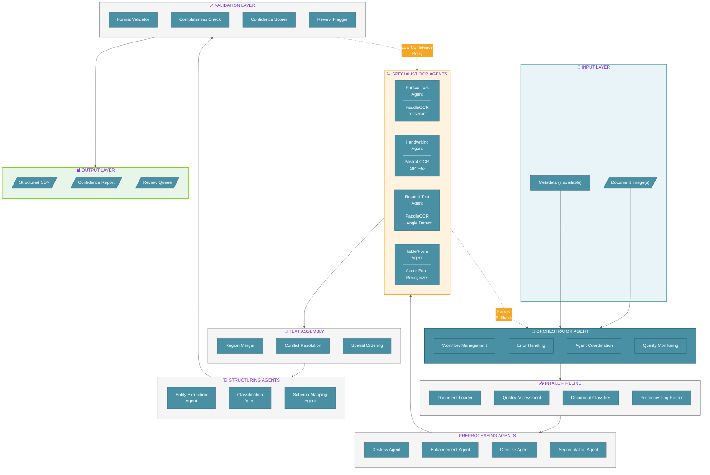
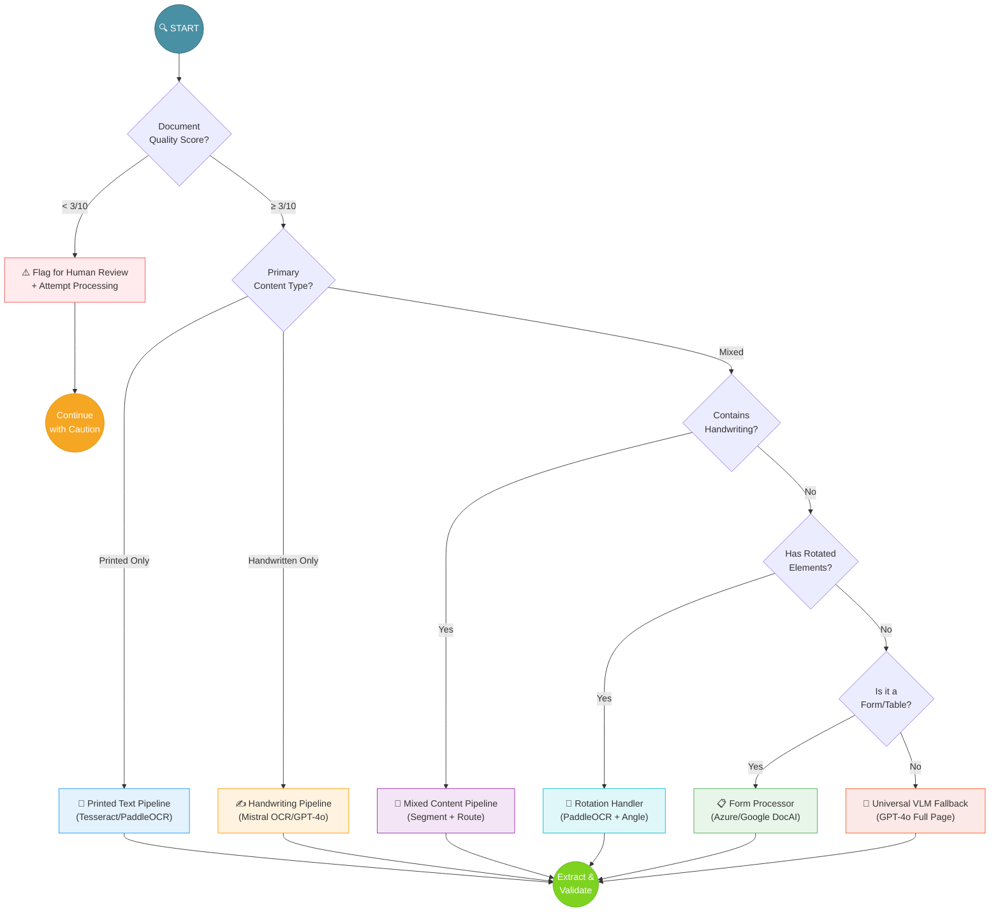
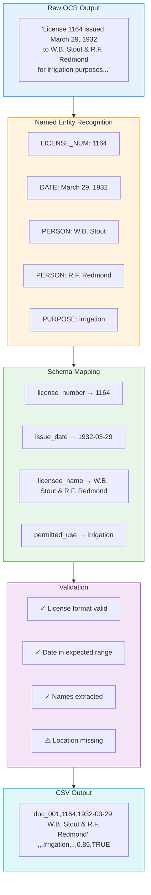

```mermaid
%%{init: {'theme': 'base', 'themeVariables': { 'primaryColor': '#4A90A4', 'primaryTextColor': '#fff', 'primaryBorderColor': '#2C5F6E', 'lineColor': '#5C5C5C', 'secondaryColor': '#F5A623', 'tertiaryColor': '#7ED321'}}}%%

flowchart TB
    subgraph INPUT["📄 INPUT LAYER"]
        A[/"Document Image(s)"/]
        B["Metadata (if available)"]
    end

    subgraph ORCHESTRATOR["🎯 ORCHESTRATOR AGENT"]
        direction TB
        O1["Workflow Management"]
        O2["Error Handling"]
        O3["Agent Coordination"]
        O4["Quality Monitoring"]
    end

    subgraph INTAKE["📥 INTAKE PIPELINE"]
        direction TB
        I1["Document Loader"]
        I2["Quality Assessment"]
        I3["Document Classifier"]
        I4["Preprocessing Router"]
    end

    subgraph PREPROCESS["🔧 PREPROCESSING AGENTS"]
        direction TB
        P1["Deskew Agent"]
        P2["Enhancement Agent"]
        P3["Denoise Agent"]
        P4["Segmentation Agent"]
    end

    subgraph EXTRACTION["🔍 SPECIALIST OCR AGENTS"]
        direction LR
        E1["Printed Text\nAgent\n─────────\nPaddleOCR\nTesseract"]
        E2["Handwriting\nAgent\n─────────\nMistral OCR\nGPT-4o"]
        E3["Rotated Text\nAgent\n─────────\nPaddleOCR\n+ Angle Detect"]
        E4["Table/Form\nAgent\n─────────\nAzure Form\nRecognizer"]
    end

    subgraph ASSEMBLY["📝 TEXT ASSEMBLY"]
        direction TB
        T1["Region Merger"]
        T2["Conflict Resolution"]
        T3["Spatial Ordering"]
    end

    subgraph STRUCTURE["🏗️ STRUCTURING AGENTS"]
        direction TB
        S1["Entity Extraction\nAgent"]
        S2["Classification\nAgent"]
        S3["Schema Mapping\nAgent"]
    end

    subgraph VALIDATION["✅ VALIDATION LAYER"]
        direction TB
        V1["Format Validator"]
        V2["Completeness Check"]
        V3["Confidence Scorer"]
        V4["Review Flagger"]
    end

    subgraph OUTPUT["📊 OUTPUT LAYER"]
        direction TB
        OUT1[/"Structured CSV"/]
        OUT2[/"Confidence Report"/]
        OUT3[/"Review Queue"/]
    end

    A --> ORCHESTRATOR
    B --> ORCHESTRATOR
    ORCHESTRATOR --> INTAKE
    INTAKE --> PREPROCESS
    PREPROCESS --> EXTRACTION
    EXTRACTION --> ASSEMBLY
    ASSEMBLY --> STRUCTURE
    STRUCTURE --> VALIDATION
    VALIDATION --> OUTPUT

    %% Feedback loops
    VALIDATION -.->|"Low Confidence\nRetry"| EXTRACTION
    EXTRACTION -.->|"Failure\nFallback"| ORCHESTRATOR

    classDef inputClass fill:#E8F4F8,stroke:#4A90A4,stroke-width:2px
    classDef orchestratorClass fill:#4A90A4,stroke:#2C5F6E,stroke-width:2px,color:#fff
    classDef processClass fill:#F5F5F5,stroke:#5C5C5C,stroke-width:1px
    classDef extractClass fill:#FFF3E0,stroke:#F5A623,stroke-width:2px
    classDef outputClass fill:#E8F5E9,stroke:#7ED321,stroke-width:2px

    class INPUT inputClass
    class ORCHESTRATOR orchestratorClass
    class INTAKE,PREPROCESS,ASSEMBLY,STRUCTURE,VALIDATION processClass
    class EXTRACTION extractClass
    class OUTPUT outputClass
```

---

# Document Classification Decision Tree

```mermaid
flowchart TD
    START(("🔍 START"))
    
    Q1{"Document\nQuality Score?"}
    Q2{"Primary\nContent Type?"}
    Q3{"Contains\nHandwriting?"}
    Q4{"Has Rotated\nElements?"}
    Q5{"Is it a\nForm/Table?"}
    
    A1["⚠️ Flag for Human Review\n+ Attempt Processing"]
    A2["📝 Printed Text Pipeline\n(Tesseract/PaddleOCR)"]
    A3["✍️ Handwriting Pipeline\n(Mistral OCR/GPT-4o)"]
    A4["🔄 Mixed Content Pipeline\n(Segment + Route)"]
    A5["📐 Rotation Handler\n(PaddleOCR + Angle)"]
    A6["📋 Form Processor\n(Azure/Google DocAI)"]
    A7["🤖 Universal VLM Fallback\n(GPT-4o Full Page)"]
    
    START --> Q1
    
    Q1 -->|"< 3/10"| A1
    Q1 -->|"≥ 3/10"| Q2
    
    Q2 -->|"Printed Only"| A2
    Q2 -->|"Handwritten Only"| A3
    Q2 -->|"Mixed"| Q3
    
    Q3 -->|"Yes"| A4
    Q3 -->|"No"| Q4
    
    Q4 -->|"Yes"| A5
    Q4 -->|"No"| Q5
    
    Q5 -->|"Yes"| A6
    Q5 -->|"No"| A7
    
    A1 --> CONTINUE(("Continue\nwith Caution"))
    A2 --> EXTRACT(("Extract &\nValidate"))
    A3 --> EXTRACT
    A4 --> EXTRACT
    A5 --> EXTRACT
    A6 --> EXTRACT
    A7 --> EXTRACT

    style START fill:#4A90A4,stroke:#2C5F6E,color:#fff
    style CONTINUE fill:#F5A623,stroke:#E09612,color:#fff
    style EXTRACT fill:#7ED321,stroke:#5FB318,color:#fff
    style A1 fill:#FFEBEE,stroke:#EF5350
    style A2 fill:#E3F2FD,stroke:#2196F3
    style A3 fill:#FFF3E0,stroke:#FF9800
    style A4 fill:#F3E5F5,stroke:#9C27B0
    style A5 fill:#E0F7FA,stroke:#00BCD4
    style A6 fill:#E8F5E9,stroke:#4CAF50
    style A7 fill:#FBE9E7,stroke:#FF5722
```

---

# Fallback Chain Strategy

```mermaid
flowchart LR
    subgraph PRIMARY["🥇 PRIMARY"]
        P1["Mistral OCR"]
    end
    
    subgraph SECONDARY["🥈 SECONDARY"]
        S1["GPT-4o Vision"]
    end
    
    subgraph TERTIARY["🥉 TERTIARY"]
        T1["Claude 3.5 Sonnet"]
    end
    
    subgraph FALLBACK["🔧 LOCAL FALLBACK"]
        F1["Qwen2-VL\n(Self-hosted)"]
    end
    
    subgraph BASELINE["📋 BASELINE"]
        B1["Tesseract 5\n+ PaddleOCR\nEnsemble"]
    end
    
    subgraph LAST["⚠️ LAST RESORT"]
        L1["Flag for\nHuman Review"]
    end
    
    PRIMARY -->|"Confidence < 0.7\nor API Error"| SECONDARY
    SECONDARY -->|"Confidence < 0.6\nor API Error"| TERTIARY
    TERTIARY -->|"All APIs Down"| FALLBACK
    FALLBACK -->|"Model Failed"| BASELINE
    BASELINE -->|"Still < 0.5"| LAST

    style PRIMARY fill:#4CAF50,stroke:#388E3C,color:#fff
    style SECONDARY fill:#8BC34A,stroke:#689F38,color:#fff
    style TERTIARY fill:#CDDC39,stroke:#AFB42B,color:#000
    style FALLBACK fill:#FFEB3B,stroke:#FBC02D,color:#000
    style BASELINE fill:#FF9800,stroke:#F57C00,color:#fff
    style LAST fill:#F44336,stroke:#D32F2F,color:#fff
```

---

# Entity Extraction Flow

```mermaid
flowchart TB
    subgraph RAW["Raw OCR Output"]
        R1["'License 1164 issued March 29, 1932\nto W.B. Stout & R.F. Redmond\nfor irrigation purposes...'"]
    end
    
    subgraph NER["Named Entity Recognition"]
        N1["LICENSE_NUM: 1164"]
        N2["DATE: March 29, 1932"]
        N3["PERSON: W.B. Stout"]
        N4["PERSON: R.F. Redmond"]
        N5["PURPOSE: irrigation"]
    end
    
    subgraph SCHEMA["Schema Mapping"]
        S1["license_number → 1164"]
        S2["issue_date → 1932-03-29"]
        S3["licensee_name → W.B. Stout & R.F. Redmond"]
        S4["permitted_use → Irrigation"]
    end
    
    subgraph VALIDATE["Validation"]
        V1["✓ License format valid"]
        V2["✓ Date in expected range"]
        V3["✓ Names extracted"]
        V4["⚠️ Location missing"]
    end
    
    subgraph CSV["CSV Output"]
        C1["doc_001,1164,1932-03-29,\n'W.B. Stout & R.F. Redmond',\n,,,Irrigation,,,,0.85,TRUE"]
    end
    
    RAW --> NER
    NER --> SCHEMA
    SCHEMA --> VALIDATE
    VALIDATE --> CSV

    style RAW fill:#E3F2FD,stroke:#2196F3
    style NER fill:#FFF3E0,stroke:#FF9800
    style SCHEMA fill:#E8F5E9,stroke:#4CAF50
    style VALIDATE fill:#F3E5F5,stroke:#9C27B0
    style CSV fill:#E0F7FA,stroke:#00BCD4
```
